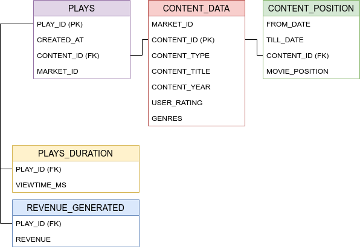

## Streaming-Platform-Dataset-Analysis

This project aims to analyze data from a streaming platform to get insights and understand how the app is performing in
terms on visualizations, user view time and benefits. The results are available on the following [dashboard](https://datastudio.google.com/reporting/697d485d-e35f-43f5-95e1-14a56774df48).

The project has 3 main levels:

* Storage Level: PostgreSQL database. To create the sql tables use `code/dataset.sql`.
* Processing Level: Python Jupyter Notebook to create a clean excel to be visualized. Execute `data_processing.ipynb` to
  generate `code/avod_data.xlsx`.
* Visualization Level: Looker Studio Dashboard.

The following image shows the storage level schema:

